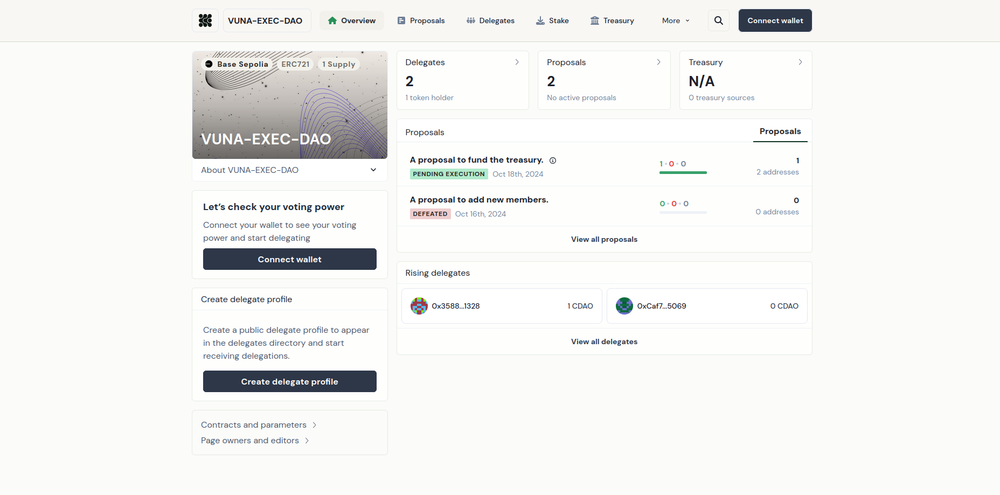
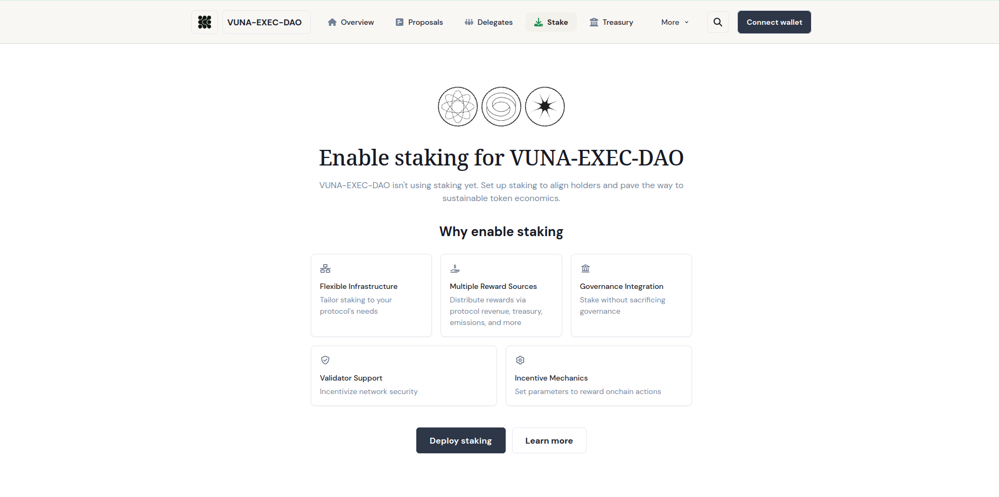
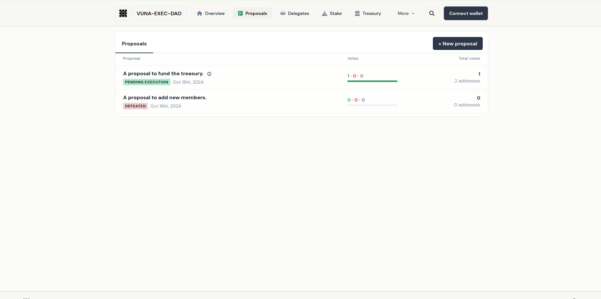
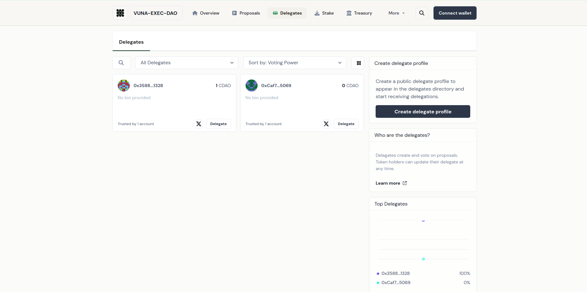
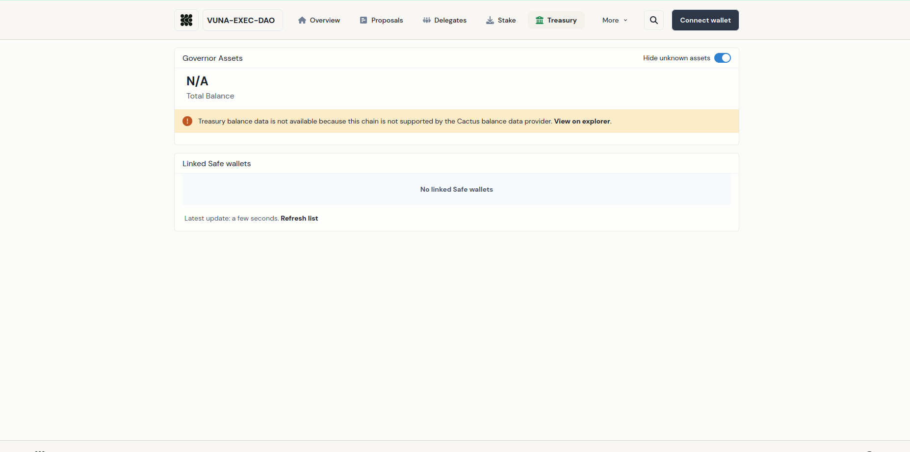
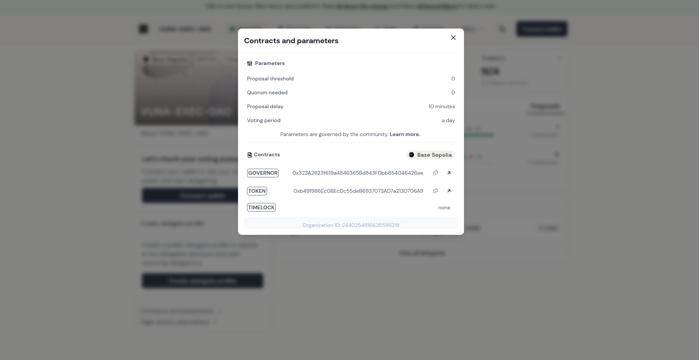

# classDAO

## NFT-Based DAO Governance Platform



classDAO is a decentralized autonomous organization (DAO) platform that uses ERC-721 NFT memberships to manage governance rights. Members receive unique NFT tokens that grant access to proposal creation, voting, delegation, and participation in organizational decision-making.

The project demonstrates practical implementation of decentralized governance using Solidity smart contracts, NFT-based membership, and on-chain voting mechanisms deployed on Ethereum-compatible networks.

---

## Live Governance Dashboard

**Tally DAO Interface**

https://www.tally.xyz/gov/vuna-exec-dao

---

## Project Overview

Traditional organizations rely on centralized leadership and manual voting processes.

classDAO introduces a decentralized governance model where:

* Membership is represented by NFTs
* Governance rights are controlled by smart contracts
* Proposals are submitted and voted on-chain
* Voting results are transparent and immutable
* Delegation allows members to assign voting power
* Treasury decisions can be governed collectively

---

## Key Features

### NFT Membership

* ERC-721 membership tokens
* One NFT per member
* Wallet-based identity verification
* Governance participation restricted to NFT holders

### Governance System

* Proposal creation
* Proposal voting
* Vote tracking
* Proposal execution
* Community-driven decision making

### Delegate Management

* Delegate registration
* Voting power delegation
* Delegate leaderboards
* Community representation

### Treasury Governance

* Treasury oversight
* Community-controlled governance
* On-chain transparency

### Transparency

* Immutable blockchain records
* Public proposal history
* Public voting records
* Verifiable governance actions

---

## Technologies Used

### Blockchain

* Ethereum
* Base Sepolia

### Smart Contracts

* Solidity
* OpenZeppelin

### Development Tools

* Hardhat
* Remix IDE
* Ethers.js
* Web3.js

### Frontend

* React.js
* Ethers.js

### Storage

* IPFS

### Governance

* Tally

---

## Smart Contract Architecture

### Governance Contract

Responsible for:

* Proposal creation
* Proposal management
* Voting
* Proposal execution

### Membership NFT Contract

Responsible for:

* NFT minting
* Membership verification
* Governance access control

---

## Smart Contracts

### Network

Base Sepolia

### Governor Contract

```text
0x323A2623f619a4846365Bd843F0bb854046426ee
```

### Membership Token Contract

```text
0xb491986Ec0BEcDc55deB6937073AD7a213D706A9
```

---

## Screenshots

### DAO Overview



### Proposal Voting System



### Delegate Management



### Treasury Governance



### Contract Configuration



---

## Governance Workflow

1. Mint Membership NFT
2. Join DAO
3. Create Proposal
4. Community Voting
5. Proposal Approval
6. Smart Contract Execution

---

## Project Structure

```text
classDAO/
├── contracts/
│   ├── Governance.sol
│   ├── MembershipNFT.sol
│   └── Lock.sol
│
├── scripts/
│   ├── deploy_with_ethers.ts
│   └── deploy_with_web3.ts
│
├── tests/
│   └── governance.test.js
│
├── frontend/
│   └── React Application
│
└── README.md
```

---

## Skills Demonstrated

* Smart Contract Development
* Solidity Programming
* ERC-721 Token Development
* DAO Architecture
* Governance Design
* Blockchain Security Concepts
* NFT Membership Systems
* Ethereum Development
* Hardhat Deployment
* OpenZeppelin Integration
* Decentralized Voting Systems
* Web3 Application Development

---

## Use Cases

* Student Organizations
* University Clubs
* Community Governance
* Investment Clubs
* Startup Governance
* Membership Organizations
* Decentralized Communities

---

## Repository Purpose

This repository serves as a portfolio project demonstrating practical experience building decentralized governance systems using NFT-based membership, smart contracts, and blockchain voting mechanisms.

---

## Contributors

### Iyobosa Amaddin

GitHub: https://github.com/codeandbe

### Oke Emmanuel Olamide

GitHub: https://github.com/ManuelHills

---

## License

MIT License
